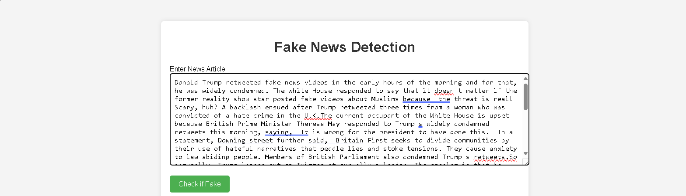
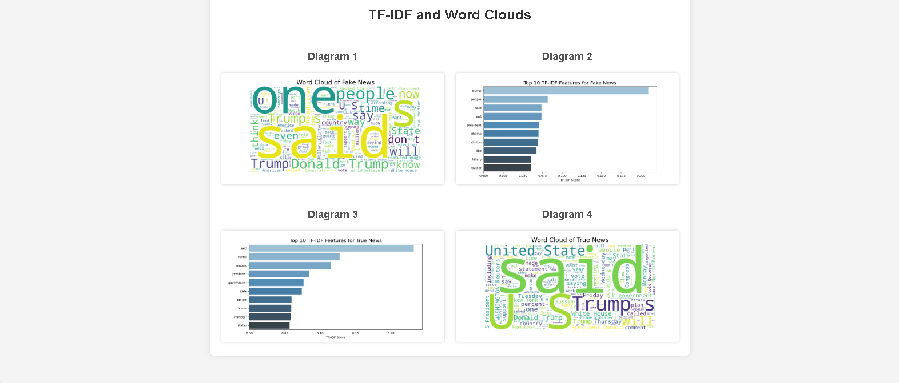
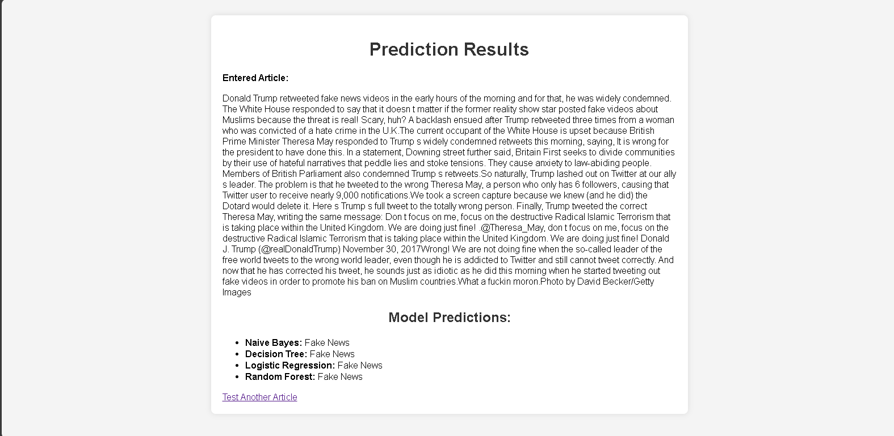

# Fake News Detection Web Application

A Flask-based web application for detecting fake news articles. This app utilizes multiple machine learning classifiers trained on labeled datasets to predict whether a given news article is fake or not. The application displays predictions from four classifiers: Naive Bayes, Decision Tree, Logistic Regression, and Random Forest.

## Table of Contents

- [Features](#features)
- [Technology Stack](#technology-stack)
- [Project Structure](#project-structure)
- [Installation](#installation)
- [Usage](#usage)
- [Datasets](#datasets)
- [Machine Learning Models](#machine-learning-models)
- [Screenshots](#screenshots)
- [License](#license)


## Features

- Accepts a news article as input via a web interface.
- Analyzes the input text using a TF-IDF vectorizer.
- Predicts the classification (Fake News or Not Fake News) using the following models:
  - Naive Bayes
  - Decision Tree
  - Logistic Regression
  - Random Forest
- Displays predictions from all classifiers in a user-friendly manner.

---

## Technology Stack

- **Backend**: Flask
- **Frontend**: HTML and Jinja2 templates
- **Machine Learning**: Scikit-learn
- **Data Handling**: Pandas, NumPy
- **Language**: Python

---

## Project Structure
```
fake-news-detection/
├── app.py                 # Main Flask application
├── templates/
│   ├── index.html         # Homepage for input
│   ├── result.html        # Result page for predictions
├── Fake.csv               # Fake news dataset
├── True.csv               # True news dataset
└── requirements.txt       # Python dependencies
```

---

## Installation

1. Clone the repository:
   ```bash
   git clone https://github.com/abilbiju/Fake-News-Detection.git
   cd Fake-News-Detection
 

2. Install the dependencies:
   ```bash
   pip install -r requirements.txt
   ```

3. Place the datasets (`Fake.csv` and `True.csv`) in the project directory.

---

## Usage

1. Start the Flask server:
   ```bash
   python app.py
   ```

2. Open your browser and visit:
   ```
   http://127.0.0.1:5000
   ```

3. Input a news article into the provided text box on the homepage.

4. Submit the form to receive predictions from all classifiers.

---

## Datasets

- **Fake.csv**: Contains labeled fake news articles.
- **True.csv**: Contains labeled true news articles.
- Each dataset has a `text` column and a `class` label:
  - `0` for fake news
  - `1` for true news

---

## Machine Learning Models

The application trains and utilizes the following classifiers:

1. **Naive Bayes**: A probabilistic model based on Bayes' theorem.
2. **Decision Tree**: A tree-structured algorithm for classification.
3. **Logistic Regression**: A statistical model for binary classification.
4. **Random Forest**: An ensemble learning method using multiple decision trees.

**TF-IDF Vectorizer** is used to preprocess the text, converting it into numerical features by capturing word importance.

---

## Screenshots

*(Include screenshots of the interface: homepage and result page. For example:)*

1. **Input Page**
   

2. **TF-IDF and Wordclouds**
   
   
4. **Results Page**
   

---

## License

This project is licensed under the MIT License. See the `LICENSE` file for details.

---

## Contributing

Contributions are welcome! Feel free to fork this repository, submit issues, or create pull requests.

---

## Acknowledgments

- Datasets used in this project are sourced from publicly available datasets on Kaggle.
- Thanks to the Scikit-learn library for providing the tools for machine learning.

---

## Contact

For questions or suggestions, please contact abilbiju2004@gmail.com
```
